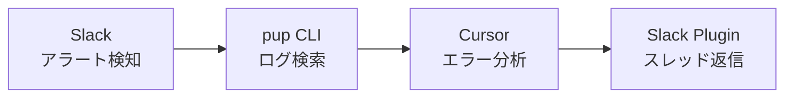
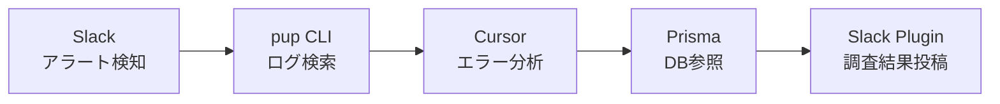

## はじめに

前回、pup コマンドを使って Datadog からのアラート調査を検証しました。今回はそこからもう1ステップ改善できるかを検証した話です。

前回の記事 : Datadogのpupと戯れあったメモ
@[card](https://zenn.dev/saku_because/articles/2026-02-13_pup-cli-datadog-investigation)

前回は AIエージェントが pup CLI を使って Datadog のエラー調査を調査してくれました。ただ、調査結果を Slack に貼るところは結局手動コピペのままでした。

「ここも自動化したいなぁ」と思っていたら、その翌週の 2026年2月17日に **Cursor Marketplace** がリリースされました。

翌日たまたま、Cursor のデザインリード Ryo 氏が来日して開催された勉強会に参加しました。

@[card](https://aiau.connpass.com/event/383750/)

その時の懇親会で[@kinopee_ai](https://x.com/kinopee_ai)さんと [@p388 cell Ꙩ→Ꙫ→Ꙭ→ꙮ→◌](https://x.com/p388cell)さんで Cursor Marketplace や Slack Plugin の仕組みを教えてもらったのが始まりです。

それを今朝試してみたら、**アラート検知 → pup で調査 → Slack スレッドに返信**まで Cursor の中だけで完結してしまったので、そのときの話を書きます。

## Cursor Marketplace が来た

2026年2月17日、Cursor が [Plugin 機能をリリース](https://cursor.com/ja/blog/marketplace) しました。


エディタ内で `/add-plugin` と打つと Plugin を検索・追加できます。Slack、Figma、Stripe、AWS、Prisma あたりが並んでいて、眺めているだけでワクワクします。


「MCP サーバーを自分で設定するのと何が違うの？」と思うかもしれません。Plugin は MCP サーバー単体ではなく、**MCP サーバー + スキル + ルール + フック + サブエージェント**をまとめたパッケージです。MCP だけだと「Slack API を叩ける」だけですが、Plugin にはそのツールをどう使うかのノウハウ（スキル）や制約（ルール）もセットで入っています。自分で MCP サーバーを立てて、`.cursor/rules` にルールを書いて、スキルファイルを用意して……という作業が、ワンクリックのインストールで済むイメージです。

## Slack Plugin を入れる

Marketplace から Slack Plugin をインストールすると、OAuth 認証のフローが走ります。


「Ran Mcp Auth in slack」と出れば認証完了。これでワークスペースの Slack を Cursor から直接触れるようになります。

認証後に使えるツールはこんな感じ。


- **`slack_send_message`** — チャンネルやユーザーにメッセージを送信
- **`slack_search_public`** — 公開チャンネルのメッセージ・ファイルを検索
- **`slack_read_channel`** — チャンネルのメッセージ履歴を取得
- **`slack_read_thread`** — スレッドの会話内容を取得
- **`slack_create_canvas`** — Slack Canvas を作成

今回使いたかったのは `slack_send_message` の**スレッド返信**です。アラートのスレッドに調査結果をそのまま返せたら最高じゃないですか。

## やってみた：アラート → 調査 → Slack 投稿

### 全体像



前回は C まではできていて、D だけ手動コピペでした。今回はその D を Plugin に任せます。

### Step 1: Slack のアラートから Trace ID をもらう

いつも通り、Datadog のアラートが Slack チャンネルに飛んできます。APM のトレース URL が貼ってあるので、そこから Trace ID を拾って Cursor に渡します。

```
https://<your-site>.datadoghq.com/apm/trace/xxxxxxxxxxxxxxxxxxxxxxxxxxxxxxxx...
```

「この trace ID 調べて」と Cursor に言うだけ。ここは前回と同じです。

### Step 2: pup CLI で調査

前回の記事で仕込んだ Cursor ルールのおかげで、pup CLI を使った調査は勝手に進みます。

```bash
pup logs search \
  --query="trace_id:<your-trace-id>" \
  --from="7d" \
  --limit=10
```

今回は2件のトレースを調べました。

**1件目：拠点CSVインポート**

| 項目 | 値 |
|---|---|
| エンドポイント | `POST /v2/xxx-csv` |
| エラー | `PayloadTooLargeException` (HTTP 413) |
| 原因 | CSV ファイルの行数が上限を超過 |
| テナント | A社 |

**2件目：アプリユーザーCSVインポート**

| 項目 | 値 |
|---|---|
| エンドポイント | `POST /v2/yyy-csv` |
| エラー | `PayloadTooLargeException` (HTTP 413) |
| 原因 | 同じく行数上限超過 |
| テナント | B社 |

どちらもバグじゃなくて、CSV の行数上限に引っかかった正常なバリデーションエラー。別テナント・別機能で同じパターンなので、「上限値そのものを見直す？」がプロダクト判断のポイント、という結論になりました。

### Step 3: Slack スレッドに投稿する ← ここが新しい

調査が終わったあと、Cursor に「このスレッドに結果を投稿して」と URL を渡しました。

Cursor は Slack の URL から Channel ID と Thread TS を勝手に抽出して、`slack_send_message` でスレッドに返信してくれます。

```
Slack URL: https://xxx.slack.com/archives/CXXXXXXXXXX/p1234567890123456
  ↓ 抽出
Channel ID: CXXXXXXXXXX
Thread TS:  1234567890.123456
```

投稿が完了すると、Slack 上の投稿 URL が返ってきます。ほんとにこれだけ。

### Step 4: 2件目も同じノリで

「じゃあ次の trace ID も調べて、終わったら Slack に投稿して」——これだけで2件目も完了。

**ブラウザを一度も開いていない。** Datadog も Slack も。全部 Cursor の中で終わりました。

## Slack に投稿してみて困ったこと

ここからは実際にハマった話です。

### Markdown テーブルが崩壊する

最初、Cursor は調査結果を Markdown のテーブル形式で投稿しようとしました。Cursor からすれば当然の判断だと思います。ただ、Slack は Markdown テーブルをレンダリングしてくれないので、投稿がグチャグチャに。

慌てて「テーブルじゃなくて箇条書きにして」と指示し直しました。試行錯誤の結果、**箇条書き + コードブロック**が一番読みやすいフォーマットでした。

```
*基本情報*
- 発生日時: 2026-0X-XX XX:XX:XX JST
- 環境: prd（本番）
- エンドポイント: `POST /v2/xxx-csv`
- HTTPステータス: 413 Payload Too Large

*エラー内容*
`PayloadTooLargeException` — CSVファイルの行数が上限を超過
- ユーザー向けメッセージ: "N行を超えるCSVファイルは..."

*結論*
バグではなく、正常なバリデーションエラー。対応不要。
```

Slack のメッセージは 5,000 文字制限もあるので、長い調査結果は `slack_create_canvas` で Canvas にするのがよさそうです（今回は箇条書きで収まりました）。

### ファイル添付はできない

スニペットや Markdown ファイルを添付したい場面があったんですが、現時点の Slack Plugin はテキストメッセージのみ対応です。ログの生データを貼りたいときにちょっと困ります。

## Before / After

前回（pup CLI のみ）と今回（pup CLI + Slack Plugin）を並べてみます。

### Before: pup CLI のみ


調査は自動化できたけど、最後の「結果をコピペして Slack に貼る」だけ手動。ブラウザを開いて、スレッドを探して、整形して貼り付ける。地味にだるい。

### After: pup CLI + Slack Plugin


「調査して」「Slack に投稿して」の2回の指示だけ。2件目以降はフローが確立しているので、ほぼ待つだけです。1件あたりの対応時間は、体感で5〜10分から1〜2分になりました。

## Prisma Plugin もあった。

Marketplace を眺めていたら、**Prisma Plugin** を見つけてしまいました。


Skills 40個、Rules 2個、MCPs 2個（Prisma Local / Remote）、Hooks 2個。すごい量です。

うちは Prisma を ORM に使っているので、これを組み合わせれば——



**やばい。全部つながる。**

実際、今回の調査でもログから取得したユーザー ID のメールアドレスを特定するには本番 DB にクエリを投げる必要があって、そこだけ手動でした。Prisma Plugin があればこの「最後の1マイル」も埋まるかもしれない。

……と興奮したところで、冷静になりました。

Prisma Plugin のスキル一覧には `prisma-cli-db-execute` や `prisma-cli-db-push` など**書き込み系のコマンド**も含まれています。「このユーザーの情報を調べて」とお願いしたつもりが、AI が `SELECT` だけでなく `UPDATE` や `DELETE` を叩いてしまう可能性——ゼロとは言い切れません。

読み取り専用の接続文字列を使う、Cursor ルールで「書き込み禁止」と縛る、といった対策はもちろん考えられます。でも、AI がルールを100%守る保証はまだない。本番 DB に対して「たぶん大丈夫」で進めるのはさすがに怖い。

このあたりのガードレールが整ってきたら改めて挑戦するとして、今回はここで止めておきます。

## まとめ

pup CLI で Datadog 調査を自動化した前回に続いて、Slack Plugin を足したら**報告まで(ほぼ)自動化**できました。

- ブラウザを一度も開かず、調査から報告まで Cursor 内で完結した
- Slack のテーブルが崩れて焦ったけど、箇条書きフォーマットに落ち着いた
- Prisma Plugin で DB 参照まで繋げたい欲はあるけど、本番 DB へのアクセスはガバナンスが先だと思う。 ← (ほぼ) と言った理由

ツールを1個足すだけでワークフローがぐっと楽になる感覚は、pup のときと同じです。一方で Prisma Plugin のくだりで感じたように、「便利だから全部つなげちゃえ」は危ない。特に書き込みが絡む操作は僕はやらかしがちなので、仕組みで止められる状態になってから手を出すべきだなと。

前回は pup に `traces` コマンドが欲しいと書きましたが、今回は Slack Plugin に**ファイル添付**が欲しいです。

pup と一緒に「ワン」ステップ改善できました。これからの花粉の季節、余計なウィンドウを開かずに仕事ができる。それだけで今日はよしとします。🐕