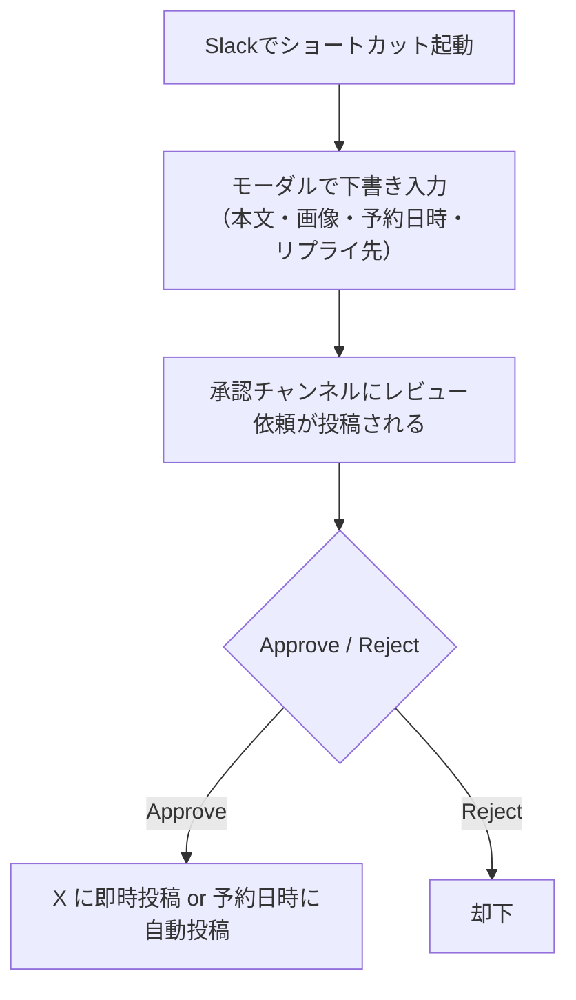

みなさん、こんにちは。Sakutaro（X: [@saku_238](https://x.com/saku_238)）です。  

このブログは[Dress Code Advent Calendar 2026/07](https://marmalade-aardwolf-939.notion.site/Dress-Code-Advent-Calendar-2026-07-e07f067a594f4401a707c2de1ba805b4)の2日目の記事です！

突然ですが、みなさんは公式Xアカウントの投稿していますか？僕はしています。

公式Xアカウントの投稿、ワークフロー式に投稿できるようになったら、便利じゃないですか？

ということで、X APIが提供されたので、slack ワークフローを活用したX投稿機能を実装したこと、そしてやめたことをこのブログで紹介します。


## 何を作ったのか

作ったのは「**Slackから公式Xアカウントに投稿するための、「 下書き→承認→投稿 」ワークフロー**」です。

やりたかったことはシンプル。

- これまで「公式アカウントにアクセスできる人だけが投稿する」というルールだったが、**チームの誰でも下書きを出せるようにしたい**。ただし一人が勝手に投げるのではなく、**レビューしてから公開したい**
- そのレビューのために毎回別のツールを開くのは面倒。**普段使っているSlackだけで完結させたい**
- ついでに**予約投稿**や**画像添付**もしたい

というものです。イメージとしてはこんな流れです。



投稿者以外の人が「Approve」を押して初めてXに出る、という承認フローを挟めるのがポイントです。

## 技術スタック

- **[Deno Slack SDK](https://api.slack.com/automation/deno)** — Slackの次世代プラットフォーム。ワークフロー・関数・トリガーをTypeScriptで書いてSlackにデプロイできる
- **X API v2**（ツイート投稿）+ **OAuth 1.0a**（署名認証）
- **X API v1.1**（画像アップロード・ALTテキスト設定）

OAuth 1.0a の署名処理は、**[SRE NEXT](https://sre-next.dev/2026/) コミュニティの [かいものさん（@ShoppingJaws）](https://x.com/ShoppingJaws)** が作ってくれた実装をベースにしています。文字数カウント・画像・予約投稿など、ワークフローまわりのこだわりはこのあと紹介します。

## きっかけ：SRE NEXT から持ち帰った OAuth 1.0a 実装

このワークフローを動かすうえで最初のハードルだったのが、X API への OAuth 1.0a 署名です。これを **外部ライブラリなしで実装してくれたのが、SRE NEXT コミュニティの [かいものさん（@ShoppingJaws）](https://x.com/ShoppingJaws)** でした。僕はその実装をいただき、Deno Slack SDK のワークフローに載せ替えて使わせてもらいました。

X API への投稿には OAuth 1.0a の署名（HMAC-SHA1）が必要です。普通ならライブラリを入れたくなるところですが、かいものさんの実装は **Deno 標準の Web Crypto API だけ**で署名を組み立てていました。Deno Slack のホスティング環境でも依存が少なくて安心、というのが採用の決め手でした。

なお、きっかけとなった **[SRE NEXT 2026](https://sre-next.dev/2026/)** は **7/10（金）・7/11（土）** に TOC有明で開催されます（テーマは「Inclusive SRE」）。信頼性に関心のあるエンジニア向けのコミュニティベースのカンファレンスで、オンライン視聴もあります。この記事が Advent Calendar 2日目なので、開催まであと1週間弱——興味があればぜひ。

以下、特に参考になった実装の抜粋です。

```typescript
async function hmacSha1(key: string, data: string): Promise<string> {
  const enc = new TextEncoder();
  const cryptoKey = await crypto.subtle.importKey(
    "raw",
    enc.encode(key),
    { name: "HMAC", hash: "SHA-1" },
    false,
    ["sign"],
  );
  const sig = await crypto.subtle.sign("HMAC", cryptoKey, enc.encode(data));
  return btoa(String.fromCharCode(...new Uint8Array(sig)));
}
```

OAuth 1.0aは「パラメータを辞書順にソートしてパーセントエンコードし、署名ベース文字列を作って署名する」という手順が地味に面倒で、`!'()*` を追加でエンコードするなどの細かい仕様に従う必要があります。

```typescript
function percentEncode(str: string): string {
  return encodeURIComponent(str).replace(
    /[!'()*]/g,
    (c) => `%${c.charCodeAt(0).toString(16).toUpperCase()}`,
  );
}
```

ここを乗り越えると、あとは `Authorization: OAuth ...` ヘッダーを付けて `fetch` するだけでツイートが投稿できます。

## こだわりポイント① 文字数カウントをX本家と一致させる

「280文字以内」を承認画面に出したいのですが、Xの文字数カウントは**単純な `text.length` ではありません**。

- 日本語（CJK）や絵文字は**2文字**としてカウント
- 英数字・基本的な記号は**1文字**
- URLは実際の長さに関係なく**一律23文字**

これは [twitter-text v3](https://github.com/twitter/twitter-text) の仕様で、これに合わせないと承認画面の文字数がXの実際とズレます。仕様表（コードポイント範囲）に従って重み付けしました。

```typescript
function charWeight(codePoint: number): number {
  if (
    (codePoint >= 0 && codePoint <= 4351) ||     // Latin など
    (codePoint >= 8192 && codePoint <= 8205) ||
    (codePoint >= 8208 && codePoint <= 8223) ||
    (codePoint >= 8242 && codePoint <= 8247)
  ) {
    return 1;
  }
  return 2;                                        // CJK・絵文字など
}
```

承認画面には `文字数: 137/280` のように表示され、超過時は `(over limit!)` を出すようにしています。

## こだわりポイント② 画像アップロードとALTテキスト

画像添付は、SlackにアップされたファイルをダウンロードしてXに再アップロードする流れです。画像のアップロードだけは今でも **X API v1.1**（`media/upload.json`）を使う必要があり、`media_data` にbase64を渡します。大きい画像でスタックが溢れないよう、base64化はチャンクに分けて処理しています。

さらにアクセシビリティ対応として、画像ごとに**ALTテキスト（代替テキスト）**を設定できるようにしました。画像を添付すると、本文モーダルの送信後に「ALTテキスト入力用モーダル」が続けて開く、という2段モーダル構成です。Slackのモーダルは状態を持てないので、1段目の入力内容を `private_metadata` にJSONで詰めて2段目に引き継いでいます。

## こだわりポイント③ 予約投稿

予約投稿は、承認時に **Scheduled Trigger** を動的に生成することで実現しています。承認された瞬間に「指定日時に一度だけ発火するトリガー」を作り、そこに下書き本文・画像・リプライ先などを渡します。

```typescript
const triggerResult = await client.workflows.triggers.create({
  type: TriggerTypes.Scheduled,
  name: "Scheduled X Post",
  workflow: `#/workflows/${PostScheduledTweetWorkflow.definition.callback_id}`,
  inputs: { /* draft_text, image_file_ids, ... */ },
  schedule: {
    start_time: scheduledISOString,
    frequency: { type: "once" },
  },
});
```

日時はJST（`+09:00`）で受け取り、過去日時ならその場で即時投稿に切り替えるようにしています。

---

## そして、やめた話

さて、ここからが本題です。機能としてはしっかり動くものができました。承認フローも、予約投稿も、画像もALTテキストも。**技術的には満足のいくものでした。**

ですが、運用してみると **X APIの料金** が現実的な壁になりました。

X APIは、2026年2月より新規開発者は **Pay-Per-Use（従量課金）** がデフォルトになりました。クレジットを事前購入し、API呼び出しごとに消費していく方式です。残高が0を切ると、投稿しようとした瞬間に `402 CreditsDepleted` エラーで止まります。

実際、運用中にこのエラーを踏みました。Slack上では原因が分からず「投稿失敗」としか出ないので、**「X API のクレジットが不足しています。Billingでチャージしてください」**という専用のエラーメッセージを出す改修まで入れています。

さらに追い打ちをかけたのが、**2026年4月20日の料金改定**です（[公式告知](https://devcommunity.x.com/t/x-api-pricing-update-owned-reads-now-0-001-other-changes-effective-april-20-2026/263025)）。

| 操作 | 単価（2026/4/20〜） |
|---|---|
| 通常の投稿（テキスト・画像、URLなし） | **$0.015** / 回 |
| **本文にURLを含む投稿** | **$0.200** / 回 |
| 他者投稿の参照（リプライ先チェック等） | $0.005 / リソース |
| 画像ALTテキスト設定 | $0.005 / 回 |

ここで効いてくるのが、**本文にURLを1つ入れると単価が約13倍（$0.015 → $0.20）になる**という点です。企業の公式アカウントの投稿って、だいたいブログ記事やLPへのリンクを貼りますよね……。つまり、僕らが一番やりたい「リンク付きの告知投稿」が、一番高い操作だったのです。

加えて、2026/4/20以降はセルフサーブ枠で **API経由の引用投稿（`quote_tweet_id`）が廃止**されるなど、機能面の制約も増えていきました。

整理すると、やめた理由はこうです。

- **従量課金 × クレジット枯渇**：残高が切れると無言で投稿が止まる。運用の見張りコストが地味に重い
- **リンク付き投稿が高い**：公式アカウントの主力である告知投稿がちょうど割高な料金帯
- **仕様変更のリスク**：料金・機能が短期間で改定され、作り込んだ機能が使えなくなる可能性

「Slackから承認して投稿する」という**体験そのものは良かった**のですが、その体験を支えるX APIのコストと不確実性が、公式アカウントの投稿頻度に見合わなくなった、というのが結論です。

## その後どうしたか

X API 経由の自動投稿はやめましたが、「Slack で下書き → チームで承認」という**ワークフローそのものは残しています**。公式 X への投稿依頼が来たときは、これまでどおり Slack 上で下書きとレビューを回し、承認後の**実際の投稿だけ手動**で行う運用に切り替えました。

API コストを払い続けるより、レビューの仕組みだけ取り出した——という割り切りです。承認フローの Slack Block Kit や文字数チェックといった部品は、この形でもそのまま活きています。

## まとめ

- Slack + Deno Slack SDK で、X投稿の**下書き→承認→投稿ワークフロー**を作った
- OAuth 1.0a の署名は **SRE NEXT コミュニティのかいものさんの実装**をベースに、twitter-text 準拠の文字数カウントなどワークフローまわりは自前で組み立てた
- しかし **X APIの従量課金・料金改定** が運用コストとして重く、自動投稿はやめた
- 一方で **Slack 上の下書き→承認ワークフローは残し**、承認後の投稿は手動運用に切り替えた

「APIが提供されたから作る」だけでなく、「**その運用コストを継続的に払い続けられるか**」まで含めて設計すべきだった、という学びのあるプロジェクトでした。技術的に作れることと、運用に乗せられることは別問題ですね。

以上、Slackから X APIで投稿していたけど、やめた話でした。

最後にひとこと。X API の料金表を読んで「うちはクレジットに余裕がある。それでも Slack から承認して自動投稿したい」という方がいれば、作ったワークフローの話はできます。実装の詳細や引き継ぎのことなど、お気軽にDM ください。